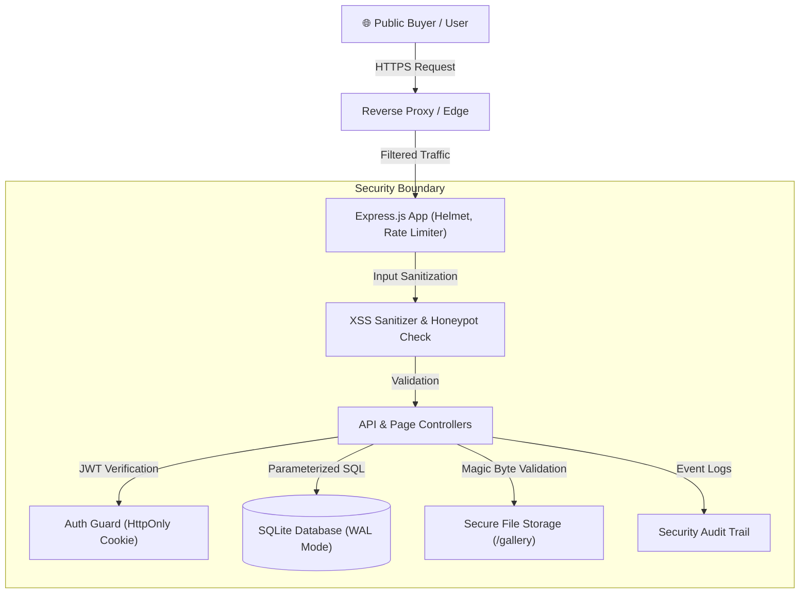

# STRIDE Threat Model & Security Architecture
**System:** VPSA YOGA FRISH PVT LTD Wholesale & Cold-Chain Logistics Web Platform  

---

## 1. System Overview & Asset Inventory
The application is a high-performance web platform and administration portal serving:
1. **Public Users / Wholesale Buyers:** Browsing varieties, viewing sourcing gallery, requesting quotations.
2. **Business Owners & Operators:** Managing gallery uploads, monitoring inquiries, tracking audit logs.
3. **Core Assets:** Admin credentials, customer quotation requests, farm sourcing data, database integrity.

---

## 2. STRIDE Threat Analysis

### 1. Spoofing (Identity)
- **Threat:** Attacker attempts to impersonate administrative user to modify gallery or steal customer lead details.
- **Countermeasure:** JWT sessions stored in encrypted `HttpOnly`, `SameSite=Strict` cookies. Passwords hashed using bcrypt (12 rounds). Failed login attempts throttled by IP rate limiter.

### 2. Tampering (Data Integrity)
- **Threat:** Attacker attempts SQL injection via contact forms or uploads malicious executables masquerading as JPEG photos.
- **Countermeasure:** Prepared statements (`better-sqlite3`) prevent SQL manipulation. File uploads undergo magic-byte binary header inspection, randomized UUID renaming, and strict 5MB size ceilings.

### 3. Repudiation
- **Threat:** User or administrator denies performing actions (e.g. deleting photos, modifying quotation statuses).
- **Countermeasure:** Immutable security audit logging with timestamps, IP address, user agent, and event type stored in `audit_logs`.

### 4. Information Disclosure
- **Threat:** Attacker triggers unhandled errors to discover database schemas, file paths, or internal server tokens.
- **Countermeasure:** Centralized error handling returns generic error messages in production. Helmet hides `X-Powered-By` headers and enforces strict Content Security Policies.

### 5. Denial of Service (DoS)
- **Threat:** Automated bot bombardment of contact forms or brute force authentication spam.
- **Countermeasure:** Multi-tier rate limiting (global 300 req/15min, auth 10 req/15min, inquiries 8 req/10min). Bounded payload limits (1MB JSON limit). Anti-bot honeypots.

### 6. Elevation of Privilege
- **Threat:** Public visitor invokes administrative upload or deletion endpoints directly.
- **Countermeasure:** Route-level authentication middleware (`requireAuthApi` & `requireAuthPage`) enforces role and session checks before processing administrative tasks.
